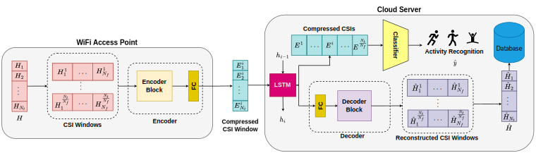

# Real-time Sensing and Compression Network
This is the Pytorch implementation of [RSCNet: Dynamic CSI Compression for Cloud-based WiFi Sensing](https://arxiv.org/abs/2402.04888)

## Abstract
WiFi-enabled Internet-of-Things (IoT) devices are evolving from mere communication devices to sensing instruments, leveraging Channel State Information (CSI) extraction capabilities. Nevertheless, resource-constrained IoT devices and the intricacies of deep neural networks necessitate transmitting CSI  to cloud servers for sensing. Although feasible, this leads to considerable communication overhead. In this context, this paper develops a novel  Real-time Sensing and Compression Network (RSCNet) which enables sensing with compressed CSI; thereby reducing the communication overheads. RSCNet facilitates optimization across CSI windows composed of a few CSI frames. Once transmitted to cloud servers, it employs Long Short-Term Memory (LSTM) units to harness data from prior windows, thus bolstering both the sensing accuracy and CSI reconstruction. RSCNet adeptly balances the trade-off between CSI compression and sensing precision, thus streamlining real-time cloud-based WiFi sensing with reduced communication costs. Numerical findings demonstrate the gains of RSCNet over the existing benchmarks like SenseFi, showcasing a sensing accuracy of 97.4% with minimal CSI reconstruction error. Numerical results also show a computational analysis of the proposed RSCNet as a function of the number of CSI frames.



## Requirements
To set up the environment, run the following command:
```bash
conda env create -f "environment.yml"
```

```bash
conda activate RSCNet
```

## Dataset
The dataset used in this paper is UT_HAR dataset. The dataset can be downloaded from [here](https://drive.google.com/file/d/1Ygw2ow8RpfKn8kF_4xmjn7YrPtuVOrGD/view?usp=sharing). The dataset should be extracted (generating a folder named "UT_HAR"). The directory of the dataset should be passed to the `--root_dir` argument of the `main.py` file.

## Training
To train the model, run the following command:
```bash
python main.py --root_dir "path_to_dataset" --compression_rate 512 --num_frames 50 --recurrent_block 256
```

Available arguments:
- `--root_dir`: The directory of the dataset
- `--compression_rate`: The compression rate of the model. For example, 512 means the model compresses the input size by a factor of 512.
- `--num_frames`: The number of CSI frames in each window
- `--recurrent_block`: The number of units in the LSTM layer
- `--batch_size`: The batch size of the model
- `--epochs`: The number of epochs for training
- `--debug`: If this flag is set, the fast_dev_run of the model is set to 2. This is useful for debugging purposes.
- `--num_workers`: The number of workers for the dataloader
- `--seed`: The seed for the random number generator

## Evaluation
The model always saves the best model based on the validation accuracy and runs the evaluation on the test set after the training is finished.

## Citation
If you use this code in your research, please cite our paper:

```
@article{barahimi2024rscnet,
  title={RSCNet: Dynamic CSI Compression for Cloud-based WiFi Sensing},
  author={Barahimi, Borna and Singh, Hakam and Tabassum, Hina and Waqar, Omer and Omer, Mohammad},
  journal={arXiv preprint arXiv:2402.04888},
  year={2024}
}
```
